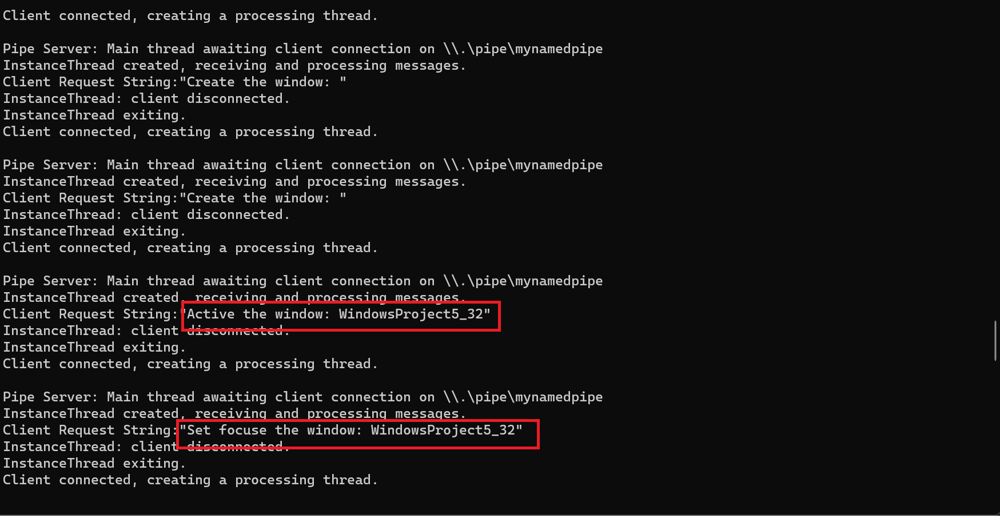

# Windows Hook Samples

This repro is used to for beingners to learn windows hook. It contains 4 projects and can split into 2 parts to demo how to use windows hooks.

## Hello World
The first part is about the project **HelloHooks** installed **WH_MOUSE_LL** hook golablly, you can run the project directly and when you move the mouse you can text printed in this conolse applicaiton like below:

## Install the golable hook using a separate dll.
The second part is other 3 projcts, and each project plays different role like below. And the Application and hooks used Pipe to comunicate with each other. So that the applicaion can print the windows affected by hooks.

|Project|Description|
|-|-|
|MyHook32|dll project which contains **Hook Procedure**|
|HelloWorldHook| **Application** which used to install the hooks|
|WindowsProject5| The process which affected by the hooks, you can test the behavor when build this project with x86 or x64|

Belows are the steps to demo how to use this:
1. Build MyHook32 project
1. Run the HelloWorldHook to install the hooks
1. Run the WindowsProject5, then you should see the output like below:

## Others
|Role|Role Description|
|-|-|
|Application|Which used to installed the hook procedure.|
|Hook Procedure|The function that intercepts a particular type of event.|
|32 or 64 bit processes|The process on windows which affected by the hooks.|

|Hook Types|Function|Calling context |Hook procedure place|
|-|-|-|-|
|Thread-specific hook|Monitors messages for all threads in the same desktop as the calling thread. |Called in the context of the associated thread |Application/Separate dll module|
|Global hooks|Monitors messages for only an individual thread.|Called in the context of any application in the same desktop as the calling thread.*Be aware that the WH_MOUSE, WH_KEYBOARD, WH_JOURNAL\*, WH_SHELL, and low-level hooks can be called on the thread that installed the hook rather than the thread processing the hook. For these hooks, it is possible that both the 32-bit and 64-bit hooks will be called if a 32-bit hook is ahead of a 64-bit hook in the hook chain.*|Separate dll module|
