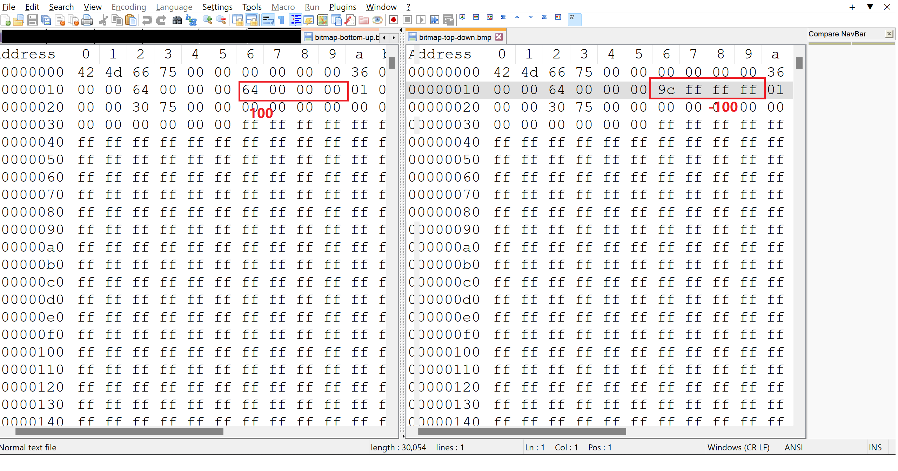
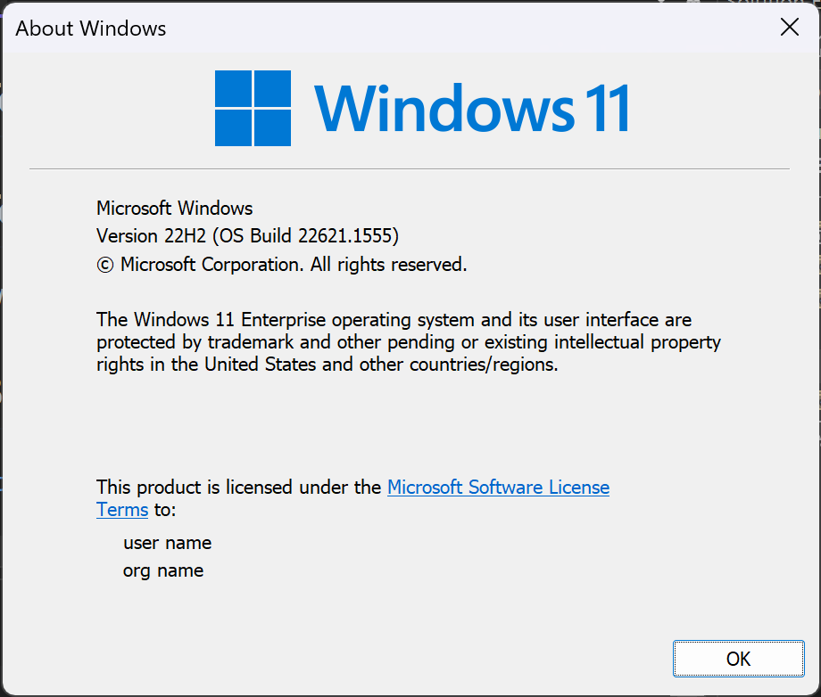
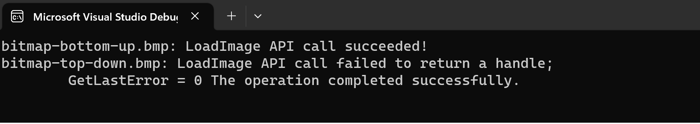

# This repo is used to test loading the negtive height of bmp on Windows

There are 2 bitmaps bitmap-bottom-up.bmp and bitmap-top-down.bmp, and the only difference of these 2 files are heigt. 1 is 100(0x64), and the other is -100(ffffff9c)

## Test Enviroment
Windows 11 Version 22H2(OS Build 22621.1555)

## Test Result

## Bug Report Link
https://aka.ms/AAkle05

## Oringal Issue Report
https://learn.microsoft.com/en-us/answers/questions/1254422/windows-10-and-11-do-not-support-top-down-bitmaps

## Other Reference
[Top-Down vs. Bottom-Up DIBs - Win32 apps | Microsoft Learn](https://learn.microsoft.com/en-us/windows/win32/directshow/top-down-vs--bottom-up-dibs)

*BITMAPINFOHEADER structure. If biHeight is positive, the image is bottom-up. If biHeight is **negative**, the image is top-down.*

